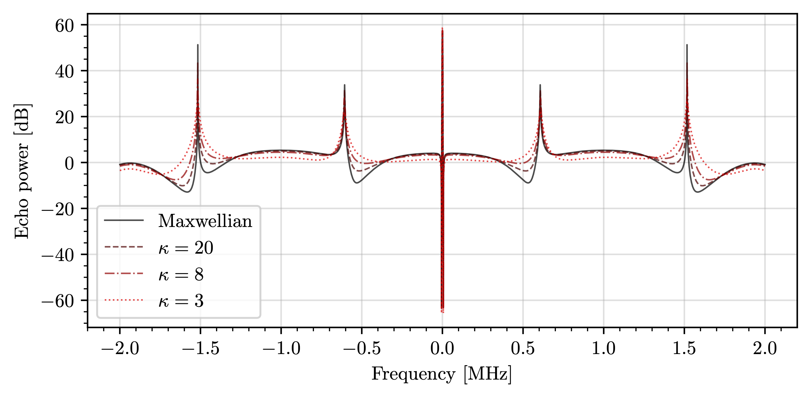

inscar
======

    INcoherent SCAtter Radar spectrum

|PyPI| |PyPI Downloads| |Status| |Python Version| |License| |Read the Docs| |Tests|
|Codecov| |DOI| |pre-commit| |Black|

.. |PyPI| image:: https://img.shields.io/pypi/v/inscar.svg
   :target: https://pypi.org/project/inscar/
   :alt: PyPI
.. |PyPI Downloads| image:: https://img.shields.io/pypi/dm/inscar.svg
   :target: https://pypi.org/project/inscar/
   :alt: PyPI Downloads
.. |Status| image:: https://img.shields.io/pypi/status/inscar.svg
   :target: https://pypi.org/project/inscar/
   :alt: Status
.. |Python Version| image:: https://img.shields.io/pypi/pyversions/inscar
   :target: https://pypi.org/project/inscar
   :alt: Python Version
.. |License| image:: https://img.shields.io/badge/License-MIT-yellow.svg
   :target: https://opensource.org/licenses/MIT
   :alt: License
.. |Read the Docs| image:: https://img.shields.io/readthedocs/inscar/latest.svg?label=Read%20the%20Docs
   :target: https://inscar.readthedocs.io/
   :alt: Read the documentation at https://ncdump-rich.readthedocs.io/
.. |Tests| image:: https://github.com/engeir/inscar/workflows/Tests/badge.svg
   :target: https://github.com/engeir/inscar/actions?workflow=Tests
   :alt: Tests
.. |Codecov| image:: https://codecov.io/gh/engeir/inscar/branch/master/graph/badge.svg?token=P8S18UILSB
   :target: https://codecov.io/gh/engeir/inscar
   :alt: Codecov
.. |DOI| image:: https://zenodo.org/badge/233043566.svg
   :target: https://zenodo.org/badge/latestdoi/233043566
   :alt: pre-commit
.. |pre-commit| image:: https://img.shields.io/badge/pre--commit-enabled-brightgreen?logo=pre-commit&logoColor=white
   :target: https://github.com/pre-commit/pre-commit
   :alt: pre-commit
.. |Black| image:: https://img.shields.io/badge/code%20style-black-000000.svg
   :target: https://github.com/psf/black
   :alt: Black
.. |CodeQL| image:: https://github.com/engeir/inscar/workflows/CodeQL/badge.svg
   :alt: CodeQL

Info
----

Calculates an incoherent scatter radar spectrum based on the theory presented in
`Hagfors (1961)`_ and `Mace (2003)`_.

Installing
----------

You can install *inscar* via pip_ from PyPI_:

.. code:: console

   $ pip install inscar

Usage
-----

Please see the `Modules Reference <Modules_>`_ for details.

Physical environment
^^^^^^^^^^^^^^^^^^^^

The plasma parameters that are supported natively by the program are

* Radar frequency ``[Hz]``

  * This will also set the radar wave number ``(= -4pi(radar frequency)/(speed of light))``

* Magnetic field strength ``[T]``
* Aspect angle ``[1]``
* Electron temperature ``[K]``
* Ion temperature ``[K]``
* Electron collision frequency ``[Hz]``
* Ion collision frequency ``[Hz]``
* Electron mass in atomic mass units ``[u]``
* Ion mass in atomic mass units ``[u]``
* Electron number density ``[m^(-3)]``
* Ion number density ``[m^(-3)]``
* Kappa value for the kappa velocity distribution function ``[1]``

Custom simulation set-ups can be made by inheriting from the different classes. Say you
want a ``Particle`` class that also carries information about the temperature of a
collection of super thermal electrons as well as some height information. You then
inherit from ``Particle`` and decorate it with the ``@attr.s`` object:

.. code:: python

    @attr.s
    class RealDataParticle(isr.Particle):
        """Create a particle object with extra attributes."""

        superthermal_temperature: float = attr.ib(
            default=90000,
            validator=is_positive,
            on_setattr=attr.setters.validate,
        )
        z: int = attr.ib(default=300)

For more examples, see the assets_ directory.

Calculation method
^^^^^^^^^^^^^^^^^^

The program support different methods of calculating the spectrum, based on how you
assume the particles to be distributed. This includes a Maxwellian distribution
(``IntMaxwell`` class) and a kappa distribution (``IntKappa`` class), in addition to any
arbitrary isotropic distribution (``IntLong`` class) which can take any ``Vdf`` as
particle velocity distribution (default is ``VdfMaxwell``). An example showing how a new
``Vdf`` class can be made is given in assets_ (``VdfRealData``).

Aside
-----

This program was developed during my master thesis. For a more detailed explanation of
the mathematical derivations and an analysis of the numerical precision of the program,
please refer to the thesis found at `munin.uit.no`_.

Contributing
------------

To contribute to the project, clone and install the full development version (uses
poetry_ for dependencies). There is also a `.rtx.toml` file that installs and sets up
an appropriate virtual environment if rtx_ is available on
your system (it's really good, check it out!).

.. code:: console

    $ git clone https://github.com/engeir/inscar.git
    $ cd inscar
    $ # Set up a virtual environment, for example with rtx
    $ rtx i
    $ poetry install
    $ pre-commit install

Before committing new changes to a branch you may run command

.. code:: console

    $ nox

to run the full test suite. You will need Poetry_, nox_ and nox-poetry_ installed for
this.

.. _Hagfors (1961): https://agupubs.onlinelibrary.wiley.com/doi/epdf/10.1029/JZ066i006p01699
.. _Mace (2003): https://aip.scitation.org/doi/pdf/10.1063/1.1570828
.. _PyPI: https://pypi.org/
.. _assets: https://github.com/engeir/inscar/tree/main/assets
.. _munin.uit.no: https://hdl.handle.net/10037/19542
.. _nox-poetry: https://nox-poetry.readthedocs.io/
.. _nox: https://nox.thea.codes/en/stable/
.. _pip: https://pip.pypa.io/
.. _poetry: https://python-poetry.org
.. _rtx: https://github.com/jdx/rtx
.. github-only
.. _Contributor Guide: CONTRIBUTING.rst
.. _Modules: https://inscar.readthedocs.io/en/latest/modules.html
